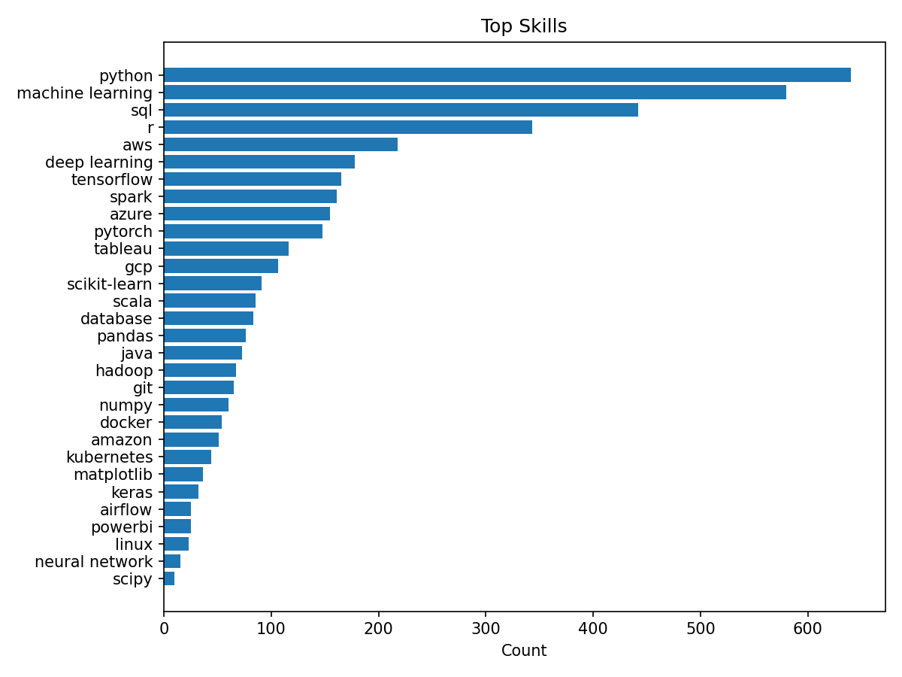

## Job skills Analyzer
پروژه Job Skills Analyzer یه نگاه تحلیلی به مهارت های کلیدی مورد نیاز در دنیای داده سازی و علم داده است. 
این پروژه از یک دیتاست دقیق و جامع که آگهی های شغلی علم داده رو با اطلاعات حقوق و مهارت های مورد نیاز تحلیل کرده، استفاده میکنه. هدف اصلی این پروژه بررسی و تحلیل مهارت هایی است که برای افرادی که میخوان وارد این حوزه بشن یا در این حوزه پیشرفت کنن، اهمیت داره.

تعداد و تنوع مهارت های مورد نیاز در علم داده به طرز چشم گیری در حال افزایشه و این کار رو برای افراد سخت میکنه که بفهمن کدوم مهارت ها مهمتر و کاربردی ترن. به همین دلیل، تصمیم گرفتم با استفاده از این دیتاست یه تحلیل دقیق انجام بدم و مهمترین مهارتها رو که در آگهی های شغلی ذکر شدن، شناسایی کنم.
این تحلیل نه تنها به افراد کمک میکنه که بدونن باید روی کدوم مهارتها تمرکز کنن - با توجه به اینکه دیتاست برای سال 2025 هست - ، بلکه میتونه برای کارفرماها هم مفید باشه که دقیقا بدونن به دنبال چه مهارتهایی در داوطلب هاشون باشن.

> در نمودار پایین 30 مهارت پرتکرار رو به ترتیب نمایش دادم. تعداد نمونه آگهی در این دیتاست: 944 مورد.

### Top 30 Skills in Data Science



1. 🥇 Python - هسته اکوسیستم داده

همونطور که قابل پیش بینی بود، پایتون صدر این نمودار قراره دارد
چراکه زیرساختی محسوب میشود که بخش اعظمی از باقی فناوری ها وابزار ها(مثل Pandas، Numpy, matplotlib و بسیاری دیگه...) روی آن ساخته شده اند.


2. 🥈 Machine Learning

چیزی که بعد دیدن این رتبه به ذهنم خطور کرد این بود که امروزه شرکت ها فقط به دانش تحلیلی نیاز ندارند بلکه
انتظار دارند نتایج داده ها به پیش بینی و تصمیم سازی منتهی شود.

مدل‌های ML دیگر در محیطای تحقیقاتی محصور نیستند؛ آنها در محصولات واقعی، سیستم‌های توصیه گر، NLP ،فرآیندهای اتوماسیون و ارزیابی ریسک به کار گرفته میشوند.

3. 🥉 SQL

برای تحلیل داده های ساختار یافته که اکثرا عملیاتی هستن SQL یک ضرورت محسوب میشه.

دیتاستی که ازش استفاده کردیم هم این موضوع رو تایید می‌کنه. به عنوان مثال، در این دیتاست نزدیک به نیمی از آگهی ها به استفاده از SQL اشاره داشتن.

___

### ⬇️ Installation

```bash
git clone https://github.com/mhhoss/job_skills_analyzer.git
cd job_skills_analyzer

python -m venv .venv
.venv/bin/activate

git clone https://github.com/mhhoss/job_skills_analyzer.git

pip install -r requirements.txt
```

___

> This project uses the "[Data Science Job Postings with Salaries (2025)](https://www.kaggle.com/datasets/elahehgolrokh/data-science-job-postings-with-salaries-2025)" dataset from kaggle, a processed collection of data‑science job listings with salary info, skills, and company attributes. The dataset is designed for job‑market analysis and salary research, and it includes fields like job title, seniority, location, industry, and an extracted skills list.